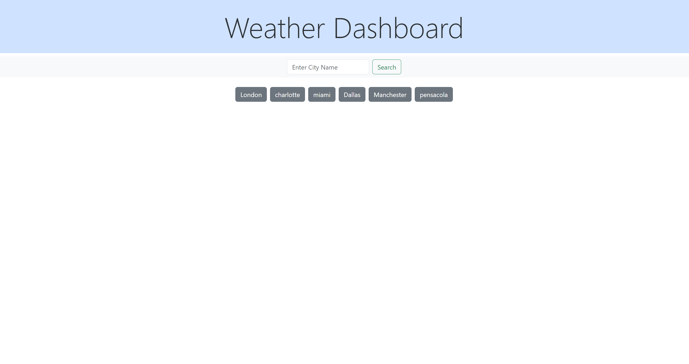
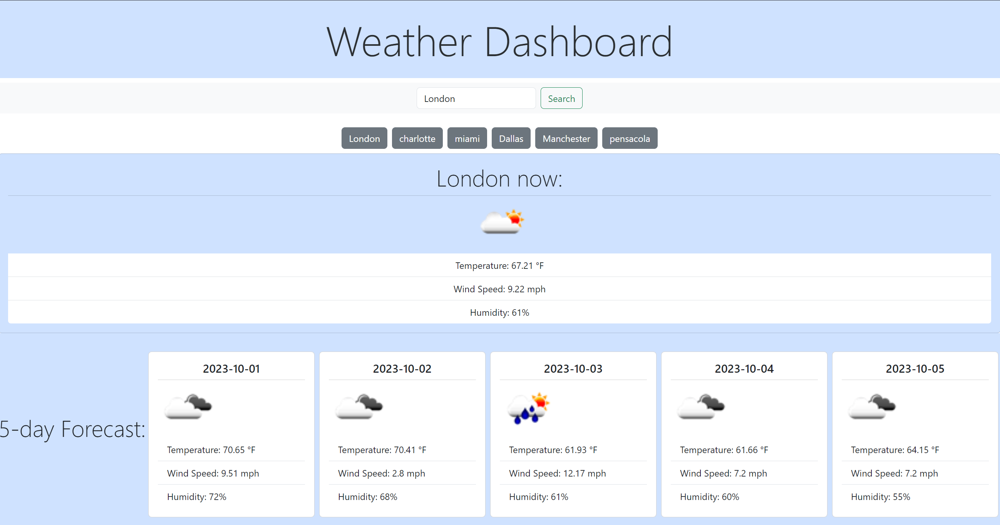

# project-weather-dashboard
A repository to hold the source code to weather dashboard application. My deployed application may be viewed through the section titled ## Deployed application link. 

## Motivation
This project exists to utilize an API and dynamically place this data onto an HTML page.

## Screenshots

Below are screenshot examples of the application, and it's functionality:

## Tech/framework used
JavaScript, HTML, CSS, Bootstrap, and Open Weather API.

## Deployed application link

Deplyed application: 

## How to use?
Open the deployed application to begin. To view a city's current weather and their forecasted weather for the next 5 days, type the city name into the search bar and press enter. Buttons will persist below said search bar, which represent city's you have already searched for. You can click these buttons to revisit the city's weather/forecasted weather.

## License

MIT © [nicanthoni]()